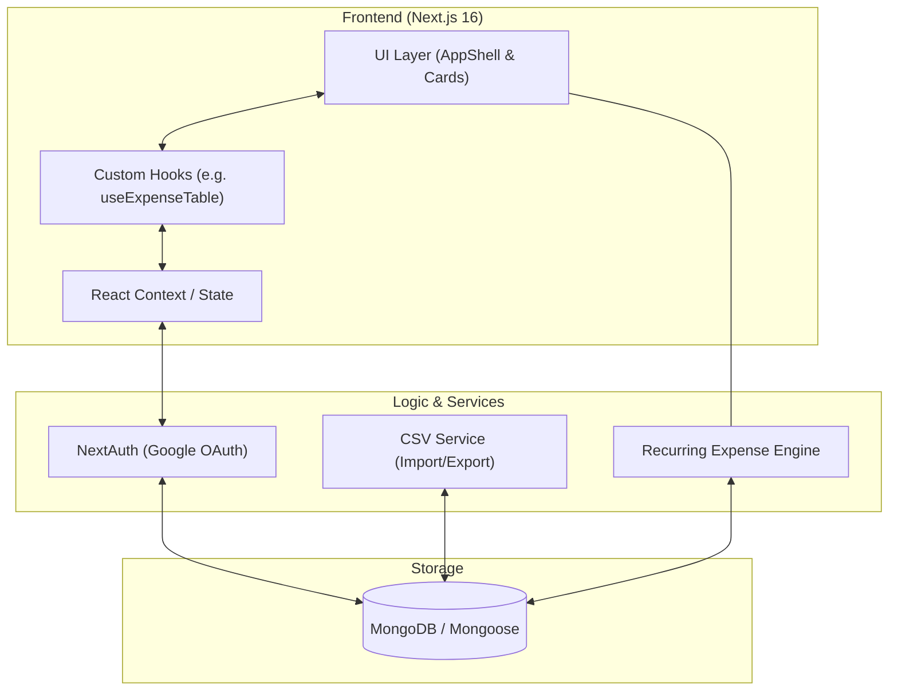
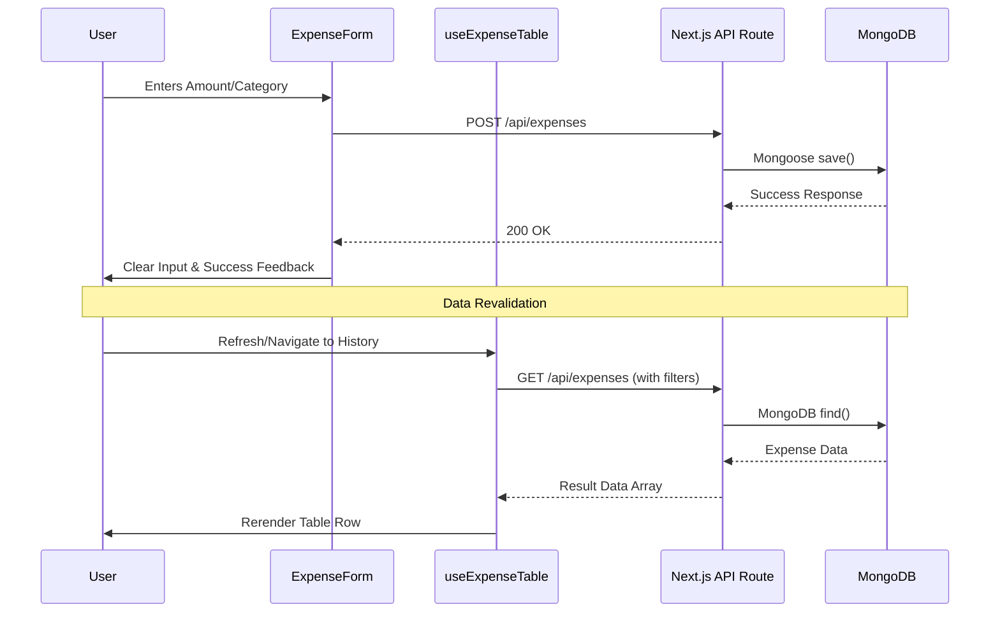

# 💎 Expense Tracker: Premium Personal Finance Tracker

**Expense Tracker** is a state-of-the-art, full-stack financial management platform designed for users who value both performance and aesthetics. Built with **Next.js 16+**, it features a sophisticated dual-theme engine (Cinematic Dark & Flipkart Light), modular "Add vs Audit" workflows, and high-performance data automation.

---

## 🌓 The Visual Experience

Expense Tracker is built with a **"Premium-First"** philosophy.

- **Flipkart-Style Light Mode**: A crisp, professional gray-scale interface with Flipkart Blue (`#2874f0`) primary actions and high-contrast labels. Perfect for high-visibility daytime use.
- **Cinematic Dark Mode**: A deep, glassmorphic dark theme using rich HSL tokens for a fatigue-free auditing experience at night.

---

## 🚀 Key Features

### 📅 Advanced Tracking

- **One-time Entries**: Lightning-fast data entry with auto-focus and default date intelligence.
- **Recurring Automation**: Setup daily, weekly, or monthly payments that automatically sync and generate records.
- **Budget Planning**: Set monthly boundaries with real-time "Target vs Spent" visualization.

### 📁 Data Hub

- **Premium Dropzone**: A dedicated Data Management Hub featuring an interactive drag-and-drop CSV uploader for bulk historical imports.
- **Intelligent Export**: One-click full-history backup in standard CSV format.
- **Format Validation**: built-in column and date-standardization guides.

### 🛡️ Secure Infrastructure

- **Google OAuth**: Enterprise-standard social login via **NextAuth.js**.
- **Audit Control**: Secure, two-step deletion workflow with custom confirmation UI to prevent data loss.
- **Data Integrity**: Powered by **MongoDB** with strict Mongoose schema validation.

---

## 📐 System Architecture

The following diagram illustrates the high-level relationship between our React components, state hooks, and backend services.



---

## 🔄 Lifecycle of an Expense

This diagram shows how data flows through the application from the moment a user clicks "Add" until it appears in the History Hub.



---

## 🛠️ Project Structure

```text
├── app/                  # App Router: Layouts, Pages, & API Routes
├── components/           # UI Components
│   ├── expenses/         # Table, Form, Filters (Atomic & Modular)
│   ├── layout/           # Sidebar, Glassmorphic AppShell
│   └── ui/               # Primary components (Input, Button, Select)
├── lib/                  # Authentication, Database, & Auth Guards
├── models/               # Mongoose Database Schemas
├── services/             # Business Logic (CSV, Recurring Engine)
├── types/                # Centralized TypeScript Definitions
├── utils/                # Date formatting, Currency, & Tailwind Helpers
└── public/               # Static Assets & Media
```

---

## 🚦 Getting Started

### 1. Prerequisites

- Node.js 18+ (or **Bun 1.2+** recommended)
- MongoDB Instance (Atlas or Local)
- Google Cloud Console Project (for OAuth)

### 2. Installation

This project uses **Bun** as the primary package manager for ultra-fast builds, but **npm** is fully supported.

**Using Bun (Recommended):**

```bash
git clone https://github.com/BhupendraLute/personal-expense-tracker.git
cd personal-expense-tracker
bun install
```

**Using npm:**

```bash
git clone https://github.com/BhupendraLute/personal-expense-tracker.git
cd personal-expense-tracker
npm install
```

### 3. Environment Config

Rename `.env.example` to `.env` and fill in your secrets:

```env
MONGODB_URI="mongodb+srv://..."
AUTH_SECRET="your-32-char-secret"
NEXTAUTH_URL="http://localhost:3000"
AUTH_GOOGLE_ID="google-client-id"
AUTH_GOOGLE_SECRET="google-client-secret"
```

### 4. Running the Development Server

**Using Bun:**

```bash
bun dev
```

**Using npm:**

```bash
npm run dev
```

Navigate to `http://localhost:3000` to see the application in action.

---

## 📜 License

Distributed under the MIT License. See `LICENSE` for details.

---

_Built with ❤️ by Bhupendra Lute_
